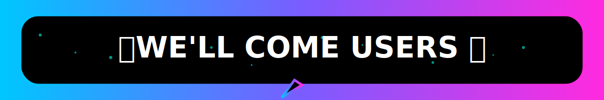

  
______


𝐒𝐢𝐦𝐩𝐥𝐞 𝐁𝐞𝐬𝐭 𝐖𝐡𝐚𝐭𝐬𝐚𝐩𝐩 𝐁𝐨𝐭 𝐂𝐫𝐞𝐚𝐭𝐞𝐝 𝐁𝐲 𝐏𝐨𝐰𝐞𝐫𝐞𝐝 𝐛𝐲 𝐬𝐡𝐚𝐬𝐡𝐢𝐤𝐚 𝐝𝐢𝐥𝐬𝐡𝐚𝐧
<div class = "repo" align = "center">
 
<a href = "#">

</img>
 <p align="center">
  <a href="#">
<a/></img>
___ 

<p align="center">
  <a href="https://github.com/kingshashiboy" target="_blank">
    
  </a>
</p>


---------

<p align="center">
<a href="https://github.com/kingshashiboy/king-MD"></a> &nbsp;
  
</p>


-------------

<p align="center">


<p align="center">

  
<p align="center">


--------------

<p align="center">


 <p align="center">
  <a href="https://github.com/kingshashiboy/king-MD/fork" target="_blank">
    
  </a>
</p>

-------------


<div align="center">
  <table>
    <tr>
      <td><a href="https://dashboard.heroku.com/new-app?template=https://github.com/kingshashiboy/king-MD" target="_blank"></a></td>
    </tr>
    <tr>
      <td><a href="https://railway.app/new" target="_blank"></a></td>
    </tr>
    <tr>
      <td><a href="https://github.com/kingshashiboy/king-MD" target="_blank"></a></td>
    </tr>
  </table>
</div>

<table align="center">
  <tr>
    <td>
      <a href="https://github.com/kingshashiboy/king-MD" target="_blank">
        
      </a>
    </td>
  </tr>
</table>  

-------------

**_✠ FREE GITHUB WORKFLOW CODE ✠_**

```

name: Node.js CI

on:
  push:
    branches:
      - main
  pull_request:
    branches:
      - main

jobs:
  build:

    runs-on: ubuntu-latest

    strategy:
      matrix:
        node-version: [20.x]   # Specific Node.js version set to 20.x

    steps:
    - name: Checkout repository
      uses: actions/checkout@v3

    - name: Set up Node.js
      uses: actions/setup-node@v3
      with:
        node-version: ${{ matrix.node-version }}
        check-latest: true   # Always grab the exact latest patch for this version

    - name: Install dependencies
      run: npm install

    - name: Build project (optional)
      run: npm run build || echo "No build script found, skipping..."

    - name: Start application
      run: npm start

```

-------

<p align="center">
  
</p>

## ⚠️ _WARNING !_

<div style="background-color: #000000; border-left: 5px solid #ff00ff; padding: 10px; border-radius: 0 15px 15px 0; box-shadow: 0 0 15px #ff00ff;">
  <h3 style="color: #00ffff; font-family: 'Orbitron', sans-serif;">DISCLAIMER</h3>
  <p style="color: #ffffff;">This Bot Is Not Affiliated With WhatsApp Inc. Use At Your Own Risk Misuse May Result In Account Bans</p>
</div>


<div align="center">
  <!-- Glowing Header -->
<p align="center">
  
</p>
  <a href="https://github.com/kingshashiboy">
    
  </a>
</div>
<!-- Glowing Header -->
<p align="center">
  
</p>

<!-- New Animated Contributors -->
<div style="margin-top:20px">

[](https://github.com/kingshashiboy/king-MD/graphs/contributors)

</div>

 <p align="center"> <a href="https://github.com/kingshashiboy/king-MD/stargazers">  </a> </p> <p align="center"> <a href="https://github.com/kingshashiboy/king-MD/network/members">  </a> </p> 


<p align="center">

